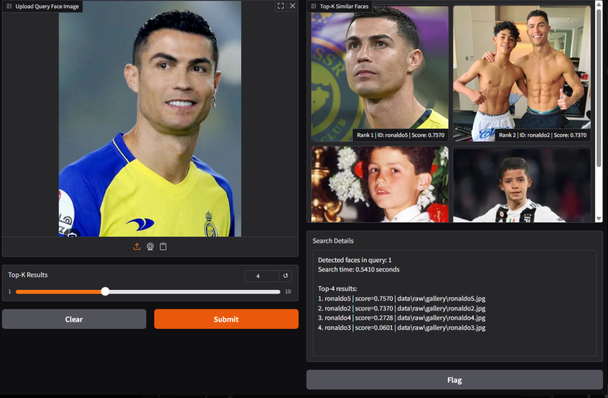

# Age-Aware Face Search System

A local face search system that uses InsightFace/ArcFace to extract face embeddings and cosine similarity to retrieve the most similar faces from a local gallery.

> The current version is a face search baseline. The age-aware component is planned as a future extension for age-aware or cross-age face search.

## Key Features

- Face detection with InsightFace.
- Face embedding extraction using a pretrained ArcFace model.
- Embedding normalization and cosine similarity matching.
- Local gallery embedding database generation.
- Top-k similar face retrieval from a query image.
- Interactive Gradio demo interface.
- Search details including similarity scores, detected face count, and search time.

## Pipeline

### Gallery Building

```text
Images in data/raw/gallery
        |
        v
Face Detection
        |
        v
Embedding Extraction
        |
        v
Save to models/gallery_embeddings.pkl
```

### Face Search

```text
Query Image
        |
        v
Face Detection
        |
        v
Embedding Extraction
        |
        v
Cosine Similarity Search
        |
        v
Top-K Ranking
        |
        v
Display Results in Gradio
```

## Tech Stack

- Python
- InsightFace
- ArcFace pretrained model pack `buffalo_l`
- ONNX Runtime
- OpenCV
- NumPy
- scikit-learn
- Pillow
- Gradio

## Project Structure

```text
Age_Aware_Face_Search_System/
|
|-- data/
|   |-- raw/
|   |   |-- gallery/        # Images used to build the gallery
|   |   `-- query/          # Query images or temporary demo images
|   |-- processed/
|   `-- generated/
|
|-- models/
|   `-- gallery_embeddings.pkl
|
|-- src/
|   |-- app/
|   |   `-- gradio_app.py   # Gradio demo interface
|   |
|   |-- recognition/
|   |   |-- face_embedder.py     # Face detection and embedding extraction
|   |   |-- build_gallery.py     # Gallery embedding database builder
|   |   |-- search_engine.py     # Top-k search with cosine similarity
|   |   `-- test_insightface.py  # InsightFace quick test script
|   |
|   |-- preprocessing/
|   `-- evaluation/
|
|-- notebooks/
|-- results/
|   |-- metrics/
|   `-- screenshots/
|
|-- requirements.txt
|-- README.md
`-- .gitignore
```

## Installation

### 1. Create a virtual environment

Windows PowerShell:

```powershell
python -m venv .venv
.venv\Scripts\activate
```

### 2. Install dependencies

```powershell
python -m pip install --upgrade pip
pip install -r requirements.txt
```

Note: On the first run, InsightFace may download the `buffalo_l` model pack automatically. An internet connection may be required if the model is not already cached.

## Data Preparation

Place gallery images in:

```text
data/raw/gallery/
```

Example:

```text
data/raw/gallery/
|-- ronaldo.jpg
|-- ronaldo2.jpg
|-- messi.jpg
|-- messi2.jpg
`-- cuong.jpg
```

Recommended gallery image quality:

- Use one clear face per image.
- Prefer good lighting and minimal occlusion.
- Avoid very small faces.
- Avoid group photos for the gallery because the current system selects the largest detected face when multiple faces are found.

## How to Run

### 1. Build gallery embeddings

```powershell
python -m src.recognition.build_gallery
```

This command reads all valid images from `data/raw/gallery/`, extracts face embeddings, and saves the result to:

```text
models/gallery_embeddings.pkl
```

### 2. Run the Gradio demo

```powershell
python -m src.app.gradio_app
```

Open the URL printed in the terminal. It is usually:

```text
http://127.0.0.1:7860
```

In the interface, upload a query image and select the number of `Top-K` results. The app returns the most similar gallery images with similarity scores.

## Screenshots



## Quick InsightFace Test

Place a test image at:

```text
data/raw/query/test.jpg
```

Then run:

```powershell
python -m src.recognition.test_insightface
```

The script checks image loading, face detection, and prints the detected embedding shape.

## Person ID Naming Rule

In `build_gallery.py`, `person_id` is inferred from the image filename:

- If the filename is `person_001_01.jpg`, the `person_id` becomes `person_001`.
- If the filename has no underscore, such as `ronaldo.jpg`, the `person_id` becomes `ronaldo`.

Use consistent filenames if you want multiple images to be grouped under the same identity.

## Example Output

```text
Detected faces in query: 1
Search time: 0.5410 seconds

Top-5 results:
1. ronaldo | score=0.7570 | data/raw/gallery/ronaldo5.jpg
2. ronaldo | score=0.7370 | data/raw/gallery/ronaldo2.jpg
3. ronaldo | score=0.2728 | data/raw/gallery/ronaldo4.jpg
4. ronaldo | score=0.0601 | data/raw/gallery/ronaldo3.jpg
5. messi | score=0.0123 | data/raw/gallery/messi.jpg
```

Higher scores mean the query embedding and gallery embedding are more similar.

## Current Limitations

- The current version is a face search baseline, not a complete age-aware system.
- Search quality depends heavily on gallery and query image quality.
- Images with multiple faces may produce incorrect results because the system selects the largest detected face.
- FAISS or a vector database is not used yet, so large-gallery search is not optimized.
- The evaluation module is not fully implemented yet, such as Recall@1, Recall@5, or mAP.
- The system runs on CPU by default with `ctx_id=-1`, so performance depends on the machine.

## Future Improvements

- Add FAISS for faster search on larger galleries.
- Add an evaluation pipeline with Recall@K, precision, and mAP.
- Allow users to select a specific face when multiple faces are detected.
- Add age estimation or age-aware re-ranking.
- Evaluate cross-age search on datasets such as AgeDB or FG-NET.
- Add Docker support for easier deployment.

## Developer Notes

- Rebuild `models/gallery_embeddings.pkl` after adding, removing, or renaming images in `data/raw/gallery/`.
- `src.recognition.FaceEmbedder` currently uses `ctx_id=-1`, which means CPU mode. Change it to `ctx_id=0` if GPU support and ONNX Runtime GPU are configured correctly.
- Avoid committing sensitive or personal face images if the repository is public.
